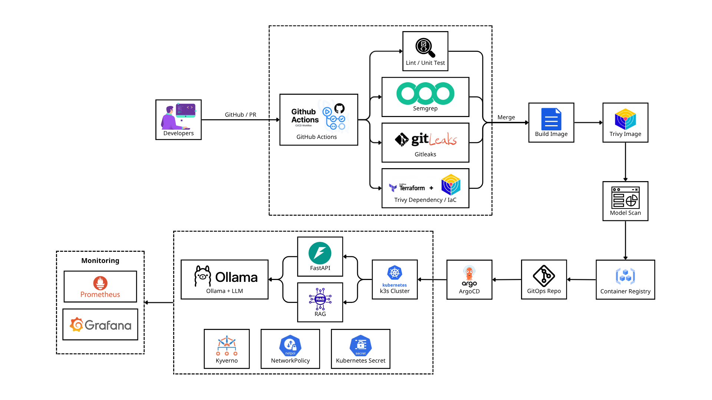

# SentraOps

**DevSecOps & LLMOps for Gen-AI Applications on Kubernetes**

SentraOps là project xây dựng quy trình **DevSecOps + LLMOps** cho một ứng dụng Gen-AI RAG chạy trên Kubernetes.

Mục tiêu là tích hợp security xuyên suốt vòng đời:

```
Develop → Scan → Red-team → Deploy → Monitor
```

và đánh giá hiệu quả của các lớp bảo vệ thông qua các số liệu thực tế.

---

## Architecture



---

## Tech Stack

| Category | Technologies |
| --- | --- |
| Application | FastAPI, Chroma, Ollama, Qwen2.5 |
| Infrastructure | Docker, Kubernetes, k3s, Helm, Terraform |
| CI/CD | GitHub Actions, ArgoCD |
| Security | Gitleaks, Semgrep, Trivy, ModelScan, Kyverno |
| LLM Security | promptfoo, Custom Guardrail |
| Monitoring | Prometheus, Grafana |

---

## Security

SentraOps áp dụng security ở nhiều lớp:

- **Code:** Gitleaks, Semgrep
- **Dependency / Image / IaC:** Trivy
- **Model:** ModelScan
- **LLM:** promptfoo + custom guardrail
- **Kubernetes:** Kyverno + NetworkPolicy
- **Runtime:** Prometheus + Grafana

Các kết quả được đánh giá dựa trên những chỉ số như:

- Attack Success Rate (ASR)
- False Positive Rate
- Latency
- Recovery Time

---

## Repository Structure

```
app/
├── app/               # FastAPI application
├── tests/             # Unit tests
├── helm/              # Helm charts
├── terraform/         # Infrastructure as Code
├── security/          # Security configurations
├── redteam/           # LLM security tests
├── monitoring/        # Monitoring configuration
├── .github/           # CI/CD workflows & repository rules
├── Dockerfile
└── README.md
```

GitOps manifests được quản lý trong repository riêng:

```
gitops/
```

---

## Local Development

### Requirements

- Docker
- Docker Compose
- Python 3.x
- Ollama

### Run

```
git clone <repository-url>
cd app

docker compose up --build
```

Health check:

```
curl http://localhost:<PORT>/health
```

---

## Project Structure

SentraOps được phát triển theo mô hình:

```
app repository
      │
      │ CI/CD
      ▼
GitOps repository
      │
      ▼
     ArgoCD
      │
      ▼
 Kubernetes
```

---

## Team

| Role | Responsibility |
| --- | --- |
| Infra & App | Terraform, k3s, Helm, FastAPI, RAG, Ollama, Chroma |
| CI/CD Security | GitHub Actions, Security Gates, ArgoCD, Kyverno, NetworkPolicy |
| LLM Security & Monitoring | promptfoo, Guardrail, Prometheus, Grafana |

---

## Purpose

SentraOps được xây dựng cho mục đích **academic research and demonstration**, tập trung vào việc chứng minh khả năng tích hợp DevSecOps và LLMOps cho ứng dụng Gen-AI trên Kubernetes.